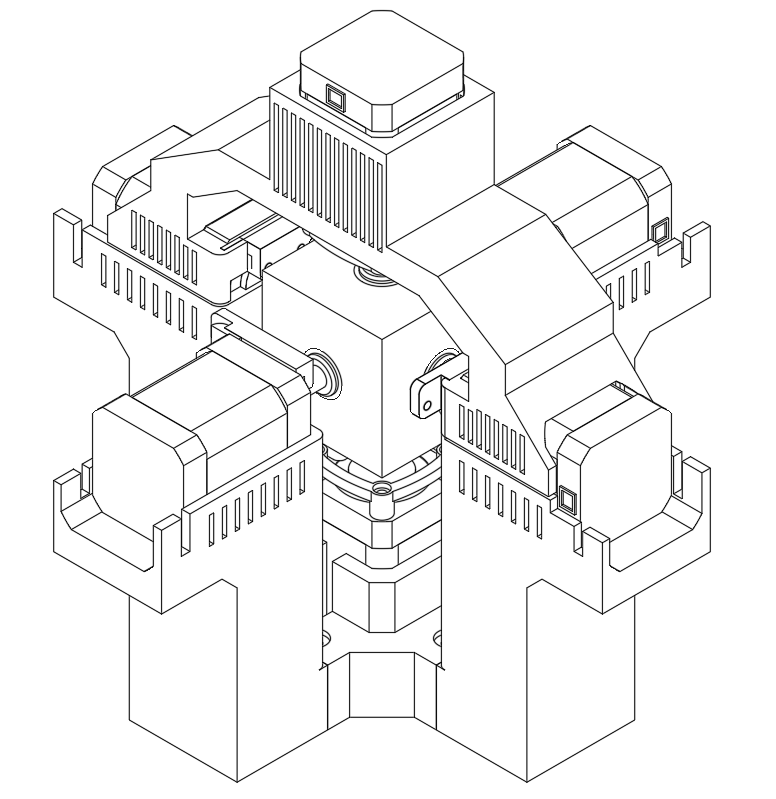
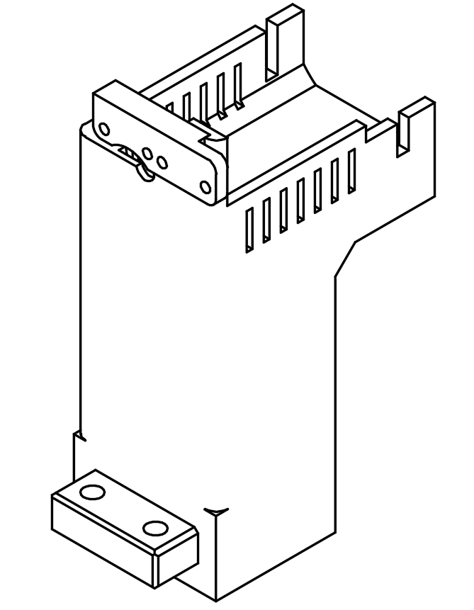
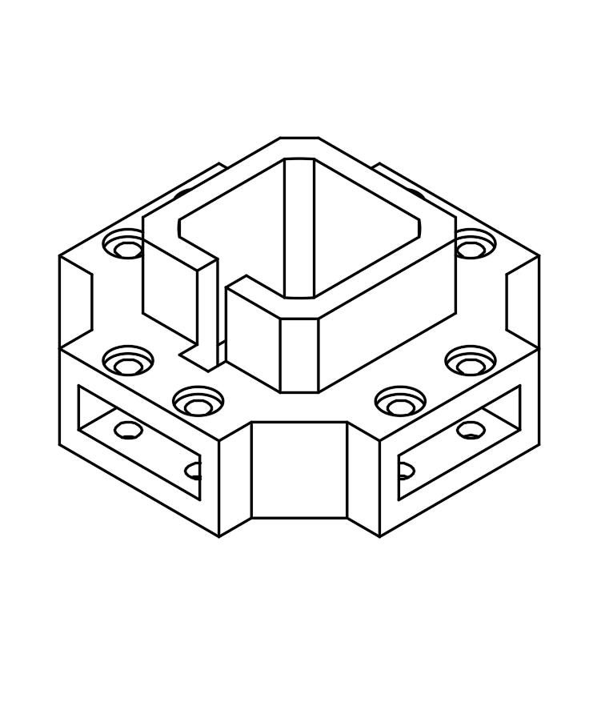
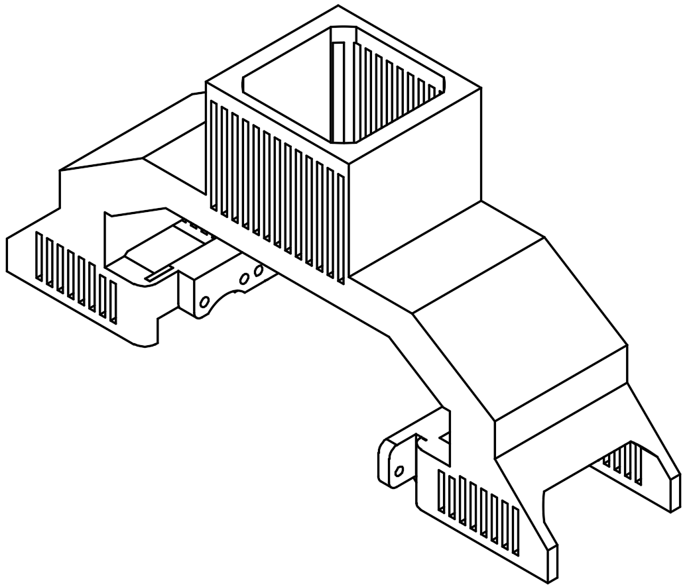

# 3D Files
This directory contains all the 3D files of the bot.

## Final Product
The assembled bot measures XX by XX by XX centimeters. Note that behind each side motor there is space for a rectangular piece that prevents the motor from sliding backwards — we highly recommend using it.

The following are the individual parts:

## The Claw
Our stepper motor has a fully cylindrical shaft, which made it very difficult to secure the claw firmly in place. If your stepper motor has a chamfered shaft — which we highly recommend — you will need to modify the claw design to fit it.

## The Tower
Four of these towers support each side motor and are bolted to the main piece using XX bolts.

## The Base
A motor is placed inside this base facing upward, and the four towers attach to each of its sides.

## The Top
The top piece sits on top of two opposing motors, with the last motor mounted inside it, facing downward.

